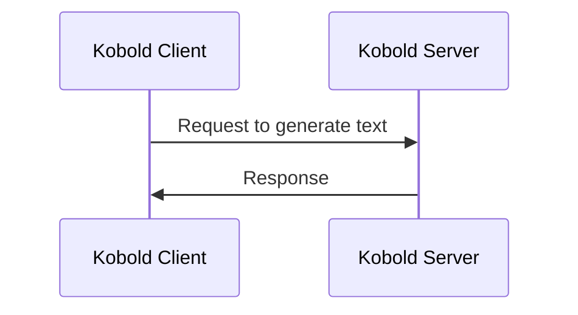
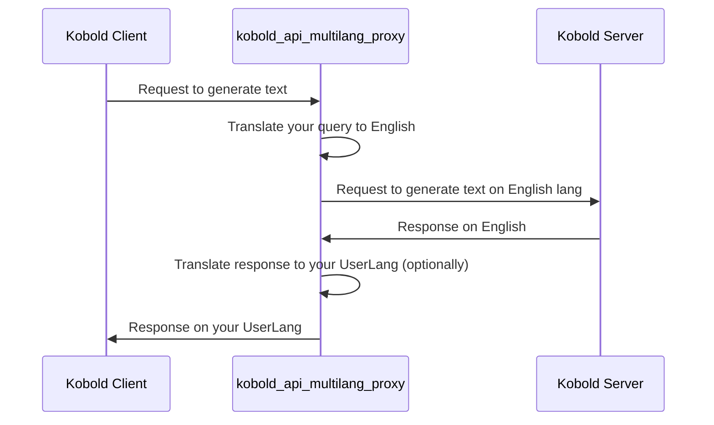

# Kobold API Proxy translation server

**Proxy server that allow you to use KoboldAI API on your UserLanguage.**

**Provide advanced logic to auto-translate income prompts:**
Due to advanced logic script splits income prompt by lines, and cache translation results.
 
Features:
- **Text quality feature:** when it generate English response, it cache it too (so you don't do double-translation English->UserLang->English next time)
- **Multi translation engines**. You can setup your own translator, if you want (throw OneRingTranslator option)

Contra:
- Doesn't support streaming mode (at least, yet)

_Tested at least on koboldcpp KoboldAPI interface._

## How does it work?

Classically, you work with Kobold API that way:


If you use kobold_api_multilang_proxy, it will be that way:


So, proxy will work with ANY Kobold Client and Kobold Server (in most cases).

## One-click installer for Windows

https://github.com/janvarev/kobold_api_multilang_proxy_win_installer

## Install and run

To run: 
1. Install requirements ```pip install -r requirements.txt```
2. Run server.py.
3. After first run, edit `settings.json` to fill params (especially kobold_url to target correct Kobold Server)
4. In Kobold Client use proxy path to use proxy (like `http://127.0.0.1:5020/`, where this proxy server is located)

Example for [SillyTavern Kobold Client](https://github.com/Cohee1207/SillyTavern):


## Core settings description

Located in `settings.json` after first run.

```python
{
    'port': 5020, # port for connect
    'is_advanced_translation': True, # usually always use advanced translation
    'kobold_url': "http://localhost:5001", # kobold API that we proxy
    'translator': 'GoogleTranslator', # GoogleTranslator or OneRingTranslator.
    'user_lang': '', # user language two-letters code like "fr", "es" etc.
    'custom_url': "http://127.0.0.1:4990/", # custom url for OneRingTranslator server
    'translate_user_input': True, # translate user input to EN
    'translate_system_output': True, # translate system output to UserLang
    'is_listen': False, # true: public interface (0.0.0.0), false: only local interface (localhost, 127.0.0.1)
},
```

